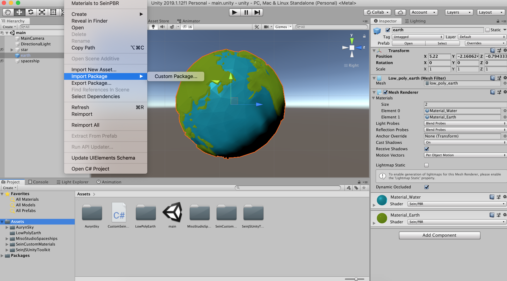
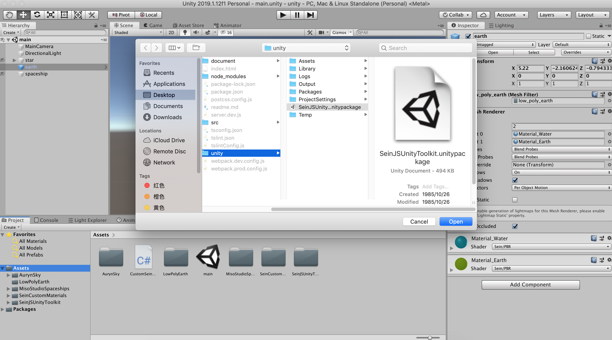
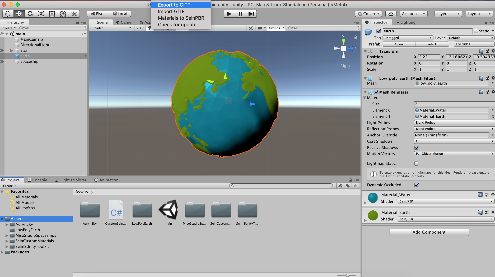
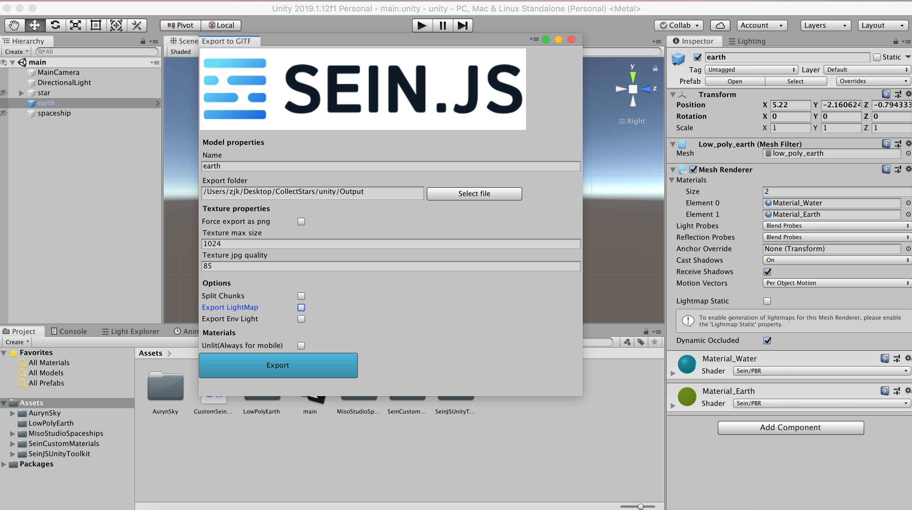
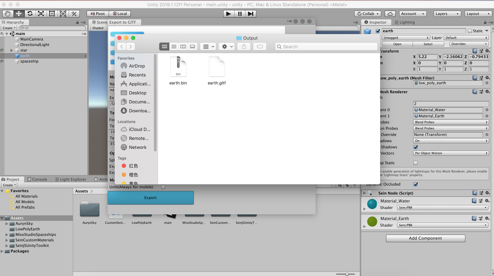
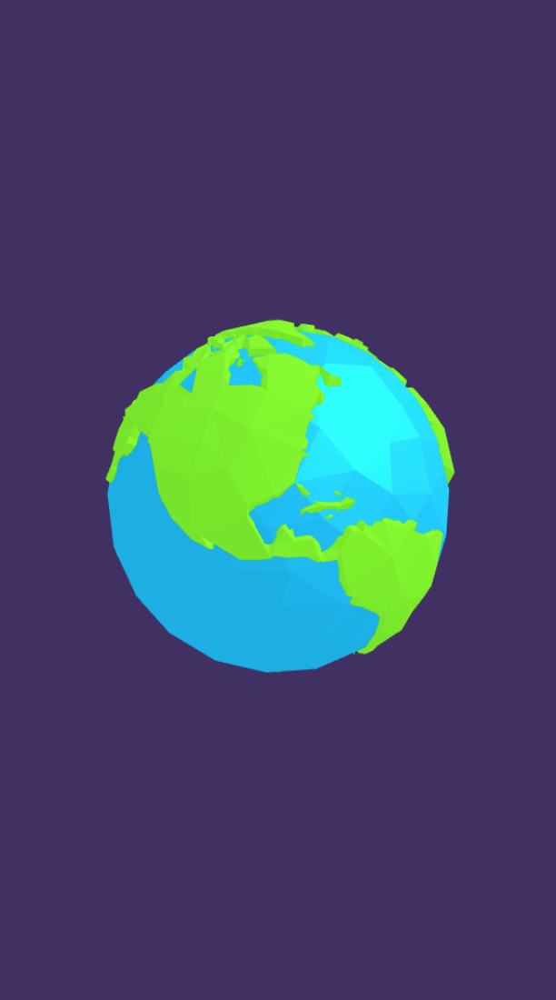

# Chapter-1：glTF格式模型导出和加载显示

在3D游戏中，模型资源是不可缺少的，你不能寄希望于所有的模型都用基本几何体表示，那样的话你会耗费大量的时间在模型的建立和调整上。加载建模美术资源是必要的，glTF是一种被广泛支持和推荐的格式，在本教程的游戏流程开发过程中也极力推荐。

## unity模型资源导入导出

- step1：在unity中``import``3D模型资源，生成prefab，将prefab资源调整放置在场景中你所希望的位置

- step2：在unity工程中导入SeinJS插件——SeinJSUnityToolkit，这个插件存储在``src/game/unity/SeinJSUnityToolkit.unitypackage``中



- step3：选中你需要导出的模型资源 **（请注意先选中）**，在unity工具栏中点击``SeinJS``并选择``Export to GlTF``。在插件的交互界面中修改你需要导出的模型资源的名称，导出资源的默认路径为``src/game/unity/Output``



- step4：导出的资源一般含有``xxx.bin``、``xxx.gltf``以及``texture``，在这里的低多边形风格的地球模型中，由于贴图直接采用了``baseColor``，所以没有纹理图片。


-step5：将导出的所有文件一并拷贝至项目的``src/assets/gltfs``文件夹下

## 在项目中加载显示模型

对于游戏中的大部分资源，我们可以采用``loader``进行加载，主要的工作在``MainLevelScript.ts``中。

在``MainLevelScript``类中的``onPreload()``函数中调用``game.resource``的``load``方法加载你的glTF资源。

```
public onPreload() {
    const game = this.getGame();

    game.resource.load({type: 'GlTF', name: 'earth.gltf', url: '../../assets/gltfs/earth.gltf'});
}
```

在``MainLevelScript``类中的``onLoading(state: Sein.IResourceState)``函数中获取游戏中资源加载的状态。

在``MainLevelScript``类中的``onCreate()``函数中调用``game.resource``的``instantiate``方法实例化你的模型。

```
public onCreate() {
    const game = this.getGame();

    game.resource.instantiate<'GlTF'>('earth.gltf');
}
```

让你的项目跑起来，你就能看到一个低多边形风格的地球模型显示出来了。

## 潜在的踩坑点

- 注意在unity中设置好你的模型在世界坐标系中的坐标位置以及模型大小，不然可能由于模型处于视野范围外、距离相机距离太远或者模型太小等原因看不到。

## 章节成果展示



## 章节代码参考

// TODO
// MainLevelScript.ts

