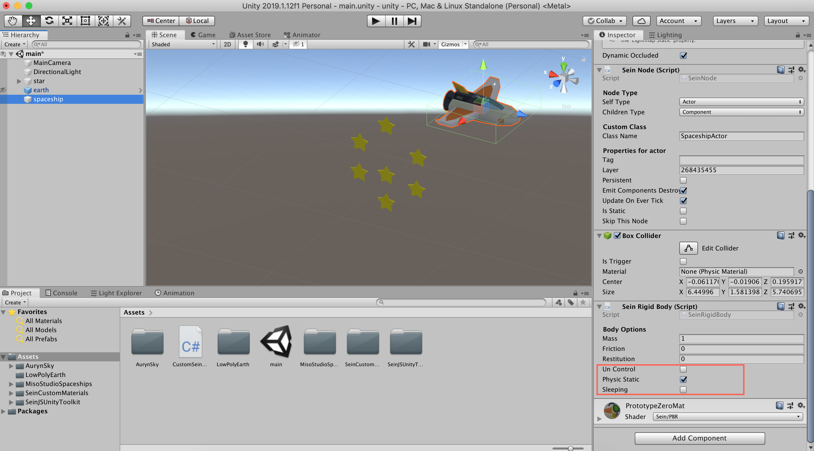
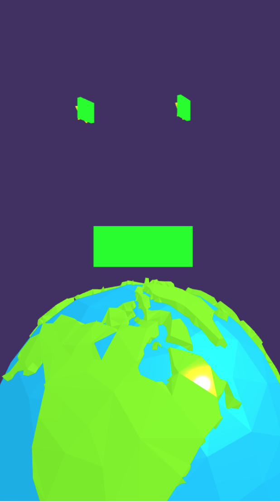

# Chapter-6：物理世界与碰撞检测

在绝大部分游戏中，需要对游戏世界中发生交互关系的两个物体进行碰撞检测，并进行后续的逻辑处理。在碰撞检测中，需要引入物理世界。

物理世界和3D模型世界并不完全统一，对于碰撞检测等基础事件的处理需要进行两次坐标转化。

```
3D模型世界 --> 物理世界判断碰撞等 --> 响应反馈3D模型世界
```

在物理世界中，碰撞检测为基础事件，它主要通过包围盒求交实现。在碰撞精度要求不高的情况下，请尽量选择简单的碰撞包围盒。

在这一章，我们将给飞船和星星挂上碰撞体，并判断两者的碰撞事件，当检测到两者发生碰撞时，则受到碰撞的星星消失，即收集到星星，并且收集星星数量累加。

## Collider和Sein Rigid Body

在这里，我们在unity中，以给飞船添加``collider``和``Sein Rigid Body``为例，简单介绍一下两者的设置方法。每一颗星星也需要按照类似的步骤添加``collider``和``Sein Rigid Body``，此处不再赘述。

- step1：添加``Collider``，这里由于对碰撞检测的要求不高，选用简单的``Box Collider``

- step2：添加``Sein Rigid Body``脚本，并勾选``Physic Static``。在这个脚本中，有两个比较重要的优化参数``Un Control``和``Physic Static``，它们的意义和之前提及的3D模型世界和物理世界的转化有关。如果你的物体是纯粹由物理引擎控制的，那么勾选``Un Control``，优化禁用3D模型世界向物理世界的坐标计算；如果你的物体是由AI或者玩家控制的，那么请勾选``Physic Static``，优化禁用物理世界计算后向3D模型世界的反馈计算；如果你只是一个纯静态的模型，判断它的点击或者拾取事件，那么两者都可以勾选，优化禁用。在这里，由于飞船的行为是玩家控制的，星星的运动也是由游戏系统逻辑控制的，所以两者均勾选``Physic Static``。在这里，还有一个``Sleep``优化参数，勾选它，那么物体将不加入物理世界进行计算，不过，拾取等事件依旧能够判断。



- step 3：导出GlTF格式模型，并移动至``src/assets/gltfs``

## 物理世界的启用和初始化

Sein.js引擎的物理世界建立在Cannon.js物理引擎的基础上，在开始使用之前，需要做一些基础的启用和初始化工作。

在``src/game/scripts/MainGameMode.ts``中引入``CANNON``，并启用物理世界。在这里``CANNON``为模块引用，第二个参数为物理世界的重力加速度，在这里取得比较特殊，不加入重力。

```
import * as CANNON from 'cannon-dtysky';

export default class MainGameMode extends Sein.GameModeActor {
  private delta: number;

  public onError(error: Error) {
    console.log(error);
    return true;
  }

  public onAdd() {
    this.delta = 0;

    // 启用物理世界
    this.getWorld().enablePhysic(
      new Sein.CannonPhysicWorld(
        CANNON,
        new Sein.Vector3(0, 0, 0)),
    );
  }

  public onUpdate(delta: number) {
    this.delta += delta;

    if (this.delta > 2000) {
      this.delta = 0;
    }
  }
}
```

在启用物理世界时，如果你需要判断更加高级的事件，比如``ColliderEnter``和``ColliderLeave``，你需要在启用物理世界时，显示开始开关，设置第三个参数为``true``。

这时候，加载你的模型，它们就拥有物理世界的相关属性了。

## 碰撞检测

对于添加``collider``和``Sein Rigid Body``的物体，我们可以在它的``rigidbody``上添加``Collision``事件监听。在这里，只需要监听简单的``Collision``事件即可。

```
/* StarActor.ts */
@Sein.SClass({className: 'StarActor'})
export default class StarActor extends Sein.StaticMeshActor<IStarActorOptions> {
    public isStarActor: boolean = true;

    private r: number;
    private alpha: number;
    private rotationSpeed: number = 0.01;

    public onInstantiate(initOptions: IStarActorOptions) {
        // 随机设定星星的轨道半径和初相位
        this.r = 1.2 + Math.random() * 1.2;
        this.alpha = Math.random() * 6.18;

        this.transform.setPosition(-this.r * Math.cos(this.alpha), -1.2 + this.r * Math.sin(this.alpha), -2.1);

        this.rigidBody.event.add('Collision', this.handleCollision);  // 添加碰撞事件监听
        
        Sein.findActorByClass(this.getGame(), SystemActor).addStarActor(this);
    }

    private handleCollision = (args) => {
        // 回调函数
    }
}
```

在``handleCollision``的回调函数中，添加主要的碰撞检测判断后执行的逻辑。在碰撞检测到后，主要的参数中含有``selfActor``和``otherActor``。其中``selfActor``为碰撞己方，而``otherActor``为碰撞的另一方。在回调函数的逻辑中，我们从可见的星星的角度，判断碰撞的另一方是不是飞船，如果是，就消隐自身，形成星星消失的效果。**注意：这里的消失并不是模型销毁，在碰撞判断的时候，不仅需要判断碰撞的另一方是不是飞船，还需要判断自己是否可见。当然，你会有更好更恰当的方式来处理星星的消失效果……**

```
/* StarActor.ts */
// emit some source code here...
private handleCollision = (args) => {
    const game = this.getGame();
    const world = this.getWorld();

    if(args.otherActor.isSpaceshipActor && args.selfActor.visible) {
        console.log('Collision With Spaceship!');
        this.visible = false;  // 星星消隐
    }
}
```

在管理星星数量时，我们把该变量存储在``GameState``中，因为这是一个判断游戏是否结束的关键变量，和整个游戏的状态密切相关。在``GameState.ts``中，简单地引入一个``starNum``的变量，当然，一个合格的工程师理应会把它设为私有变量并追加``set``和``get``方法……

```
/* GameState.ts */
import * as Sein from 'seinjs';

export default class GameState extends Sein.StateActor {
    public starNum: number = 0;
}
```

最后在``handleCollision``回调函数中，累加星星数量。这里的星星数量``starNum``，在后续会和UI产生关联。

```
/* StarActor.ts */
// emit some source code here...
private handleCollision = (args) => {
    const game = this.getGame();
    const world = this.getWorld();

    if(args.otherActor.isSpaceshipActor && args.selfActor.visible) {
        console.log('Collision With Spaceship!');
        this.visible = false;

        // 捕获一颗星星
        this.getGame<GameState>().state.starNum ++;
    }
}
```

到此为止，当你驾驶你的飞船撞击到星星的时候，星星就会消失了，并且星星的数量会累加。

## 物理世界Debug

Sein.js提供了一个非常好用的物理世界的debug工具，它能够帮助我们在3D模型世界可视化物理世界。

- step1：安装

```
npm i seinjs-debug-tools
```

- step2：在``GameMode``中引入，并每帧更新

```
/* GameMode.ts */
import 'seinjs-debug-tools';

class MainGameMode extends Sein.GameModeActor {
  private physicDebugger: Sein.DebugTools.CannonDebugRenderer;

  public onAdd() {
    this.physicDebugger = new Sein.DebugTools.CannonDebugRenderer(this.getGame());
  }

  public onUpdate() {
    this.physicDebugger.update();
  }
}
```

你将会看到所有的碰撞体后用绿色高亮显示，帮助你判断物理世界的状态以及发生的事件。




## 潜在的踩坑点

- 在物理世界初始化时，注意重力方向和大小的设置，不同的设置以及优化参数的选择可能会导致碰撞体飘逸3D模型，或者导致两者不同步，这时比较常见的在引入物理世界时容易发生的问题。

- 优化参数的设置需要考虑具体的游戏情景进行选择，错误的选择可能导致效果偏离你的预期。在制作这个小游戏的过程中，我曾经勾选了``Un Control``和``Physic Static``两个优化参数，导致在我控制移动飞船模型时，碰撞体根本没有移动。我也曾经只勾选了``Un Control``参数，让其受物理引擎的作用，由于我设置的重力为0，直接导致它在游戏开始飞船后失去“引力”飘走……

- 物理世界的Debug可视化工具挺好用的，能帮助你判断你在物理世界的哪里出现了问题，并针对性解决。

## 章节成果展示


## 章节代码参考

// TODO
// MainGameMode.ts
// GameState.ts
// StarActor.ts
// SpaceshipActor.ts